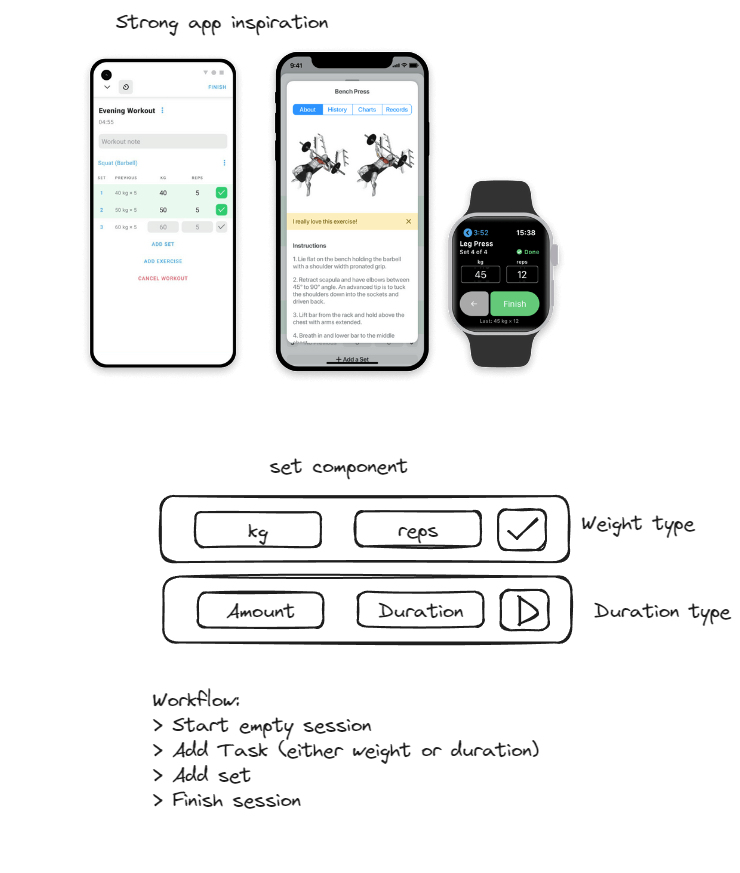

# Repit

Repit is a task completion app built with React Native, Expo, and TypeScript.

## Wireframe

<div align="center">
    
</div>

## Installation

1. Clone the repository:

    ```bash
    git clone https://github.com/Aebel-Shajan/rep-it.git
    ```

2. Install dependencies:

    ```bash
    cd repit
    npm install
    ```

3. Start the development server:

    ```bash
    npm start
    ```

4. Follow the instructions in the Expo CLI to launch the app on your device or emulator or on http://localhost:8081.

## Technologies Used

- React Native
- Expo
- TypeScript

## Contributing

Contributions are welcome! If you'd like to contribute to Repit, please follow these steps:

1. Fork the repository.
2. Create a new branch for your feature or bug fix.
3. Make your changes and commit them.
4. Push your changes to your forked repository.
5. Submit a pull request to the main repository.

## License

This project is licensed under the MIT License.
